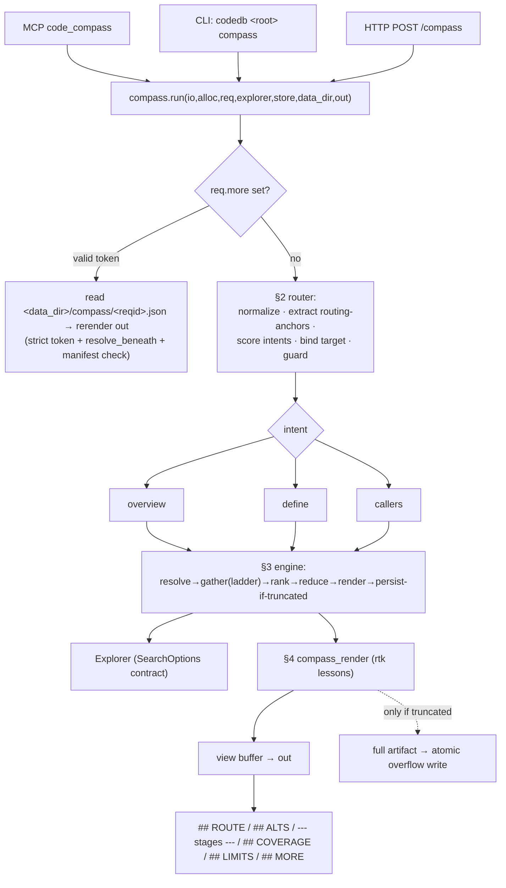

# code_compass — an intent-typed navigation tunnel inside codedb

## Context

Today an agent answering *"what does authentication look like here?"* fires a sequence of
separate codedb calls — `find` → `search` → `symbol` → `callers` — each a round-trip with
its own argument-shaping, retries, and **human-formatted output** (ANSI, prose, full
bodies) that burns tokens. The agent has to plan the navigation itself.

`code_compass` collapses that into **one call**: the agent declares an **intent** + target,
codedb runs a deterministic, chained retrieval tunnel *in-process* against the warm
`Explorer`, and returns **one lean, signal-complete answer**. The two hard requirements —
*smartly reduced* (low tokens) yet *never silently cut* (the agent can always get the full
picture on demand) — are reconciled by a **two-buffer execution model** (§3) plus
**rtk-style reduction** (§4): the reduced view always carries `showing X of N` coverage
counts, and **only when something was actually truncated** does it persist the full result
and emit a `## MORE` handle.

It is a new orchestration **layer inside codedb**, modeled on the existing single-call
composer `handleContext` (`mcp.zig:2013`) and generalized into an intent-typed,
recipe-driven engine with a scored router and self-correcting fallback ladders. This
revision incorporates a security review (§ each item tagged `[rev]`).

**Scope (confirmed):** full codedb — scored router, recipes, CLI subcommand, HTTP route,
`.codedbrc` config, manifest-backed `more` overflow. **ananke is a separate repo not in
this checkout; its integration is out of scope.** **MVP ships 3 recipes (overview, define,
callers); `blast_radius` is Phase 5 and depends on a new depth-bearing Explorer API (§3.6).**

**Success bar [rev2]:** `code_compass` is only worth promoting if broad first-touch tasks
match or beat `codedb_context`, narrow tasks do not regress direct-tool quality, ambiguous
prompts are surfaced honestly, and token wins do not come from hiding useful evidence.

---

## 1. Surfaces & data flow



Every surface builds a `CompassRequest`, resolves a `data_dir` through **one shared helper**
(§5), and calls the single entry point `compass.run`. No surface contains routing or recipe
logic.

---

## 2. Intent routing (the core)

Deterministic, rule-based, no LLM, but *scored* not first-match — phrasing, word order, and
synonyms don't flip the route. Pure stages; identical input ⇒ identical `Route` ⇒ identical
bytes.

### 2.0 Types
```zig
pub const Intent = enum { overview, define, callers }; // blast_radius added in Phase 5
pub const AnchorKind = enum { quoted, path, identifier, word };
pub const Anchor = struct { text: []const u8, kind: AnchorKind, salience: u8 };
pub const RouteState = enum { exact, ambiguous, fallback };
pub const Route = struct {
    intent: Intent,
    target: ?Anchor,
    confidence: enum { explicit, strong, weak } = .weak,
    state: RouteState = .fallback,
    runner_up: ?Intent = null,
    rationale: []const u8,
};
```

### 2.1 Stage 0 — explicit verb (bypass)
If `req.intent != null`, build `Route{ intent, confidence=.explicit }`, still run anchor
extraction (2.3) to bind the target.

### 2.2 Stage 1 — normalization
Lowercased, whitespace-collapsed copy for phrase matching; keep original-case `task` for
anchor extraction (case matters for camelCase/snake_case).

### 2.3 Stage 2 — routing-anchor extraction (always runs) **[rev]**
`extractContextCandidates` (`mcp.zig:1974`) is deliberately too strict for routing — it caps
at 3 and only accepts quoted/snake/all-caps/camelCase, so plain-language tasks ("what calls
**auth**", "definition of **render**") would under-bind. So routing uses a **dedicated,
more permissive extractor** `extractRoutingAnchors`:
- quoted spans → `quoted` (salience 3)
- token with `/` or `detectLanguage(tok) != .unknown` → `path` (2)
- token passing `looksLikeContextIdentifier` → `identifier` (2, +len tiebreak)
- otherwise a non-stopword content word ≥3 chars → `word` (1) — **used for overview
  gather and weak tie-breaking only; by itself it does not justify routing to `define` or
  `callers`**.

A small stopword set ("what","how","does","the","is","find","show","where","calls","call",
"used","uses","of","this","code","here", …) filters sentence scaffolding. Anchor presence
and kind are routing features (2.4) and the target source (2.5), but **only
quoted/path/identifier anchors may force narrow intents; `word` anchors are intentionally
weaker to avoid over-routing broad prompts**. `extractContextCandidates` is still used
*unchanged* for overview's gather-keywords — routing and gather extraction are now separate
concerns.

### 2.4 Stage 3 — scored intent selection
Each intent accumulates weighted phrase-group scores against the normalized task
(multi-word cues weight 3, single tokens 1):

| Intent | High-weight cues (3) | Low-weight (1) | Anchor modifier |
|---|---|---|---|
| `callers` | "who calls", "callers of", "call sites", "where is … called", "used by", "references to", "usages of" | "calls", "invoked", "uses" | identifier/path anchor +1 |
| `define` | "where is … defined", "definition of", "declared", "implementation of", "signature of" | "what is", "find the … (function/struct/class)" | single identifier/path anchor +2 |
| `overview` | "how does", "what does … look like", "explain", "walk me through", "architecture", "overview", "flow" | (floor=1) | **no anchor → +2** |

`overview` always has a floor; callers/define are structurally capped when no strong anchor
exists.

### 2.5 Stage 4 — decision, guard, confidence **[rev2]**
1. `winner = argmax(score)`; ties broken by fixed priority `define > callers > overview`.
2. **Validation probe:** if `winner` is `define` and `target.kind ∈ {quoted,path,identifier}`,
   run a bounded `findAllSymbols` probe; if `winner` is `callers`, run a bounded
   `searchContentWithScope` probe. No useful evidence → demote to `overview`.
3. **Margin guard:** `winner − runner_up < MARGIN(=2)` → `confidence=.weak`,
   `state=.ambiguous`, `runner_up=<runner_up>`, and default selected intent becomes
   `overview` unless the user was explicit.
4. **Target binding:** `target = req.target` else top-salience anchor. If winner needs a
   target but none exists → `state=.fallback` and demote to `overview`.
5. Build `rationale` (e.g. `callers: "who calls"+ident:parseConfig (alt: define)`) for the
   `## ROUTE` line.

`classifyIntent` is a pure `fn(task, anchors) Route`, table-tested (2.6).

### 2.6 Router tests
Table of `{task, expected_intent, expected_target}` covering every high-weight cue,
synonym/word-order variants, **plain-language word anchors staying broad**
("what calls auth" → `overview` with a `callers` alternative), no-anchor "who calls" →
demoted overview, explicit-verb bypass, validation-probe demotion, margin-guard ambiguity,
and a determinism check (same input twice ⇒ identical `Route`).

---

## 3. Tunnel execution model

Recipes are fixed pipelines over a shared `Ctx`, run by one engine driver. This is where
"reduced yet never cut" is guaranteed by construction.

### 3.1 Shared context & the two-buffer invariant
```zig
const Detail = enum { signatures, windows, bodies };
const Budget = struct { max_files: u32, per_file: u32, per_section: u32,
                        snippet_bytes: u32, detail: Detail };
const Ctx = struct {
    arena: std.mem.Allocator, explorer: *Explorer, store: *Store,
    route: Route, budget: Budget,
    cov: Coverage,              // section → {shown,total}
    limits: Limits,             // heuristic exclusions, ambiguity, stale-overflow notes
    full: *std.ArrayList(u8),   // FULL artifact / render payload
    view: *std.ArrayList(u8),   // REDUCED (→ out)
    truncated: bool,            // set true the first time shown < total
};
```
**Invariant:** each result item is emitted into `full` (uncompressed) and, subject to
`budget`, a reduced form into `view`, in the same pass from the same ranked data. The view
can never reference something the full result lacks. **Sampling truncation and heuristic
filtering are tracked separately:** `Coverage` answers "how much did we show?", while
`Limits` answers "what did we intentionally exclude or mark ambiguous?".

### 3.2 Driver: resolve → gather → rank → reduce → render → **persist-if-truncated** **[rev]**
`compass.run`:
1. **`more` short-circuit (hardened §3.5)** — validate token, read overflow under
   `compass/` with `resolve_beneath`, verify manifest, stream to `out`.
2. **route** (§2) → emit `## ROUTE <rationale>` and `## ALTS` when `state=.ambiguous`.
3. **dispatch** to recipe pipeline (builds `full` + `view`, sets `truncated`, records
   heuristic exclusions / ambiguity in `limits`).
4. **persist only if `ctx.truncated`** — when nothing was sampled-down the view *is* the
   complete answer, so we skip disk I/O and emit no `## MORE`. When truncated, atomically
   write the full artifact + manifest (§3.5) and append `## MORE reqid=<reqid>`.
5. copy `view` → `out`.

### 3.3 Gather accounting reuses the existing `--- stages ---` vocabulary **[rev]**
Rather than invent a new debug format, the fallback ladder reuses `handleQuery`'s
convention (`mcp.zig:3413`, `4169`): a `StageInfo{op, files_out}` list rendered as
`--- stages ---`, and partial failures as `--- partial ---` (mcp.zig:2824). Each recipe's
gather is an ordered array of named stages run until one yields ≥1 result; the fired stage
and its yield show up in `--- stages ---`. `## ROUTE` stays a separate one-liner for the
*intent* decision (codedb_query has no router, so this line is genuinely new). **`## LIMITS`
is rendered separately from `## COVERAGE` so agents can tell the difference between
truncation and heuristic exclusion.**

### 3.4 The three MVP recipes
1. **overview(task) [rev]** — generalizes `handleContext` but **factors shared helpers
   instead of copying**: extract `handleContext`'s file ranking (raw hits +5 def −3 test −2
   doc, `mcp.zig:2114-2151`) and its scope/test-path filter predicate into small helpers in
   `mcp.zig` that *both* `handleContext` and compass call (a justified light refactor, not a
   copy). **Primary gather keeps `handleContext`'s current ranking path**:
   `searchContentRanked` + the shared file-ranking heuristics remain the source of truth for
   broad orientation quality; the standardized `searchContentWithOptions` /
   `searchContentWithScopeOptions(SearchOptions)` contract (`explore.zig:228`) is used for
   fallback and scope/literal refinements, not as a replacement for ranked overview search.
   Sections `## DEFS`, `## FILES`, `## SITES`, `## CALLERS`. **reader.md prepend is carried
   forward behind the same long-task gate (`task.len > 80`) as `handleContext`** so compass
   does not regress broad-task orientation; if later eval shows it hurts, that change should
   happen only after parity data. Ladder: {"keywords-ranked", above} → {"literal-fallback",
   `searchContentWithOptions`} → {"fuzzy-file", `fuzzyFindFiles`+literal search}.
2. **define(target)** — ladder {"symbol", `findAllSymbols` exact} → {"word", `searchWord`}
   → {"search", `searchContentWithOptions`} → {"fuzzy-file", `fuzzyFindFiles` **only when
   the target looks path-like or basename-like**}. Signature line always; body only if
   `detail==.bodies`; cross-file dedupe by `path:line`; multiple defs all listed with
   coverage, and `## LIMITS` explicitly notes when multiple exact defs exist.
3. **callers(target) [rev]** — mirror `handleCallers` (`mcp.zig:1799`) exactly so precision
   doesn't regress: `searchContentWithScope(target)` → exclude defs via `findAllSymbols`
   (match `line_num == symbol.line_start && same path`, `mcp.zig:1850`) → **require
   `hasWholeWordMatch(line_text, target)`** (`mcp.zig:1857`, so `parseConfig` doesn't match
   `parseConfigFile`/comments) → drop non-call-site langs via `langHasCallSites`. Then group
   by `scope_name`/`scope_kind`, per-file coverage, sample top `budget.per_file`/file.
   Output flags the heuristic nature **and records dropped defs / substring rejects /
   non-call-site rejects in `## LIMITS`; if multiple defs share the name, the result is
   marked name-ambiguous rather than pretending to be a semantic call graph.**

### 3.5 `more` overflow — hardened & manifest-backed **[rev, P1]**
The repo already rejects `/ \ NUL ..` before opening files (`path_security.zig:6,104`) and
opens with `resolve_beneath`. `more` adopts the same discipline:
- **Strict token:** `reqid` must match `^[0-9a-f]{16}$` (exactly 16 lowercase hex). Reject
  anything else **before** touching the FS — no user text ever becomes a path component.
- **Dedicated dir + resolve_beneath:** files live in `<data_dir>/compass/`; open via a dir
  handle on that subdir with `.resolve_beneath = true` (mirrors `openSafeFile`,
  `path_security.zig:117`). Path is `compass/<reqid>.json` only.
- **Atomic write, then handle:** write the full artifact to `compass/<reqid>.tmp`, then
  rename to `.json`; only **after** a successful rename is `## MORE` emitted. FS error →
  degrade silently (no `## MORE`), never fail the call.
- **Manifest / staleness:** the overflow file begins with a manifest object containing
  `intent`, `target`, `task` hash, `detail`/budget, route state, and the **index+store
  generation** (so a `--more` read after a reindex is detected). `reqid =
  hex(Wyhash(intent|target|task|detail|budget|generation))` — request-shaping fields are
  folded in so a different query never collides on a stale file. On `--more`, if the
  manifest generation ≠ current → return an actionable "overflow stale, re-run query" line.
- **Eviction:** best-effort prune of `compass/` to the newest `compass_overflow_keep`
  files (config §5) on each persist.

### 3.6 `blast_radius` (Phase 5) needs a depth-bearing API first **[rev, P1]**
`getTransitiveDependents` (`explore.zig:414`) *computes* depth in `TraversalItem.depth` but
**returns a flat deduped slice that drops it** — so "depth-1 + (transitive − depth-1)" only
yields direct/indirect, not true depth buckets. Phase 5 first adds
`getTransitiveDependentsWithDepth(path, alloc, max_depth) ![]struct{ path, depth: u32 }`
(trivial: the BFS already carries `item.depth`; emit it instead of discarding). Then
`blast_radius` groups affected files by real depth with direct caller-site samples + counts.
Until that API exists, blast_radius is not shipped (avoids dishonest depth buckets).

### 3.7 Worked trace (callers)
`code_compass {intent:callers, task:"parseConfig"}` → route explicit, target `parseConfig`
→ `## ROUTE callers ident:parseConfig` → `searchContentWithScope` 17 hits → exclude 1 def,
drop 2 non-whole-word/test → 14 grouped across 6 files → full = all 14 + windows; view = top
per_file/file, `## COVERAGE callers showing 9 of 14 across 6 files`, `truncated=true` →
atomic persist → `## MORE reqid=ab12…`. Re-call `{more:"ab12…"}` reads all 14. **If the
name also has 4 defs across the repo, `## LIMITS` says so explicitly instead of implying the
callers are semantically resolved to one canonical definition.**

---

## 4. Output reduction — `compass_render.zig` (rtk lessons, reimplemented)

rtk (rtk-ai/rtk) reduces dev-command output 60–90% via a small technique set; we adopt the
ones that map to code navigation as stateless render helpers. **Render remains text-first,
but the underlying overflow payload is a structured artifact so agents can recover more than
pretty prose when needed.**

| rtk technique | compass implementation |
|---|---|
| Smart filtering (drop comments/whitespace/boilerplate) | `writeSnippet` uses `extractLines(…, compact=true)` so `isCommentOrBlank` (`explore.zig:5708`) strips comment/blank lines; lean mode, no ANSI/prose. |
| Grouping/aggregation | hits grouped file→scope; symbols by kind; (Phase 5: deps by depth). |
| Signature-only (`-l aggressive` strips bodies) | `Detail.signatures` → enclosing signature only; `.windows` (default) → ±2 lines; `.bodies` (opt-in) → full body. rtk *levels* → our `budget.detail`. |
| Deduplication (collapse repeats with counts) | `Dedupe` = `StringHashMap(void)` keyed `path:line`. |
| **Truncation with counts (never silent)** | `Coverage`: every sampling site calls `cov.record(section, shown, total)` and sets `ctx.truncated` when `shown<total`; render emits inline `(showing X of N)` + final `## COVERAGE`. |
| **Heuristic-limit surfacing** | `Limits`: every exclusion site records why content was dropped or marked ambiguous; render emits `## LIMITS` separately from `## COVERAGE`. |
| **Recovery handle ("tee": save raw on failure)** | `writeOverflow` (§3.5) persists the full artifact **only when truncated**, atomically, strict-token path; `## MORE reqid=…` re-call rerenders from the artifact. |
| Ultra-compact (`-u` inline/icons) | follow-up only. |
| Deterministic output | stable markers + ordering ⇒ identical bytes per query. |

---

## 5. New & modified files

**New:** `src/compass.zig` (types, router §2, engine + 3 recipes §3),
`src/compass_render.zig` (§4), `src/test_compass.zig`.

`compass.run` signature:
```zig
pub fn run(io: std.Io, alloc: std.mem.Allocator, req: CompassRequest,
           explorer: *Explorer, store: *Store, data_dir: []const u8,
           out: *std.ArrayList(u8)) void
```
`CompassRequest`: `intent: ?Intent`, `task`, `target: ?[]const u8`, `want_body: bool=false`,
`max_files: u32=5`, `mode: enum{summary,evidence,raw}=.summary`,
`format: enum{text,json}=.text`, `more: ?[]const u8=null`. Internal `ArenaAllocator` for
transients.

**Shared data-dir helper [rev]** — `getProjectDataDir` (`mcp.zig:206`) and `getDataDir`
(`main.zig:1345`) are near-duplicates. Factor one helper (e.g. `paths.projectDataDir`) used
by main, mcp, server, and compass instead of making `getProjectDataDir` public and
duplicating it a third time.

**`build.zig`** — add `test_compass.zig` to `test_files` (line 151) with
`.needs_mcp=true, .needs_nanoregex=true`.

**`src/mcp.zig`** — `Tool` enum (570): `codedb_compass`. `tools_list` (594): schema +
description teaching the verbs and **positioning compass as the orientation-first path only
after quality gates pass**. `dispatch` (1297): `handleCompass`. Extract the shared ranking +
scope/test filter helpers (§3.4-1). Add `codedb_compass` to
`toolDependsOnScannedIndex` (1342) and the word/trigram-load gate (1292).

**`src/main.zig`** — `else if (eql(cmd,"compass"))` near `hot` (~858): parse
`--intent/--body/--max-files/--more`; call `compass.run`. Add `"compass"` to index-load
conditions (~356) and known commands (~1279).

**`src/server.zig`** — `POST /compass` by `POST /edit` (~397), behind `isAuthorized`; parse
JSON, call `compass.run`, return `{"result":…}`. Thread-safe via Explorer's `RwLock`.

**`src/config.zig`** — `compass_max_files:u32=5`, `compass_body:bool=false`,
`compass_overflow_keep:u32=50`; extend `parse` + round-trip tests.

**Reused (no change):** `extractContextCandidates`, `looksLikeContextIdentifier`,
`isContextIdent*`, `langHasCallSites`, `hasWholeWordMatch`, `detectLanguage`; explore:
`searchContentWithOptions`, `searchContentWithScope(Options)`, `findAllSymbols`,
`fuzzyFindFiles`, `searchWord`, `getImportedBy`, `extractLines`, `isCommentOrBlank`,
`getContent`, `searchContentRanked`; path_security `openSafeFile`/`resolve_beneath`
discipline; `cio.listWriter`.

---

## 6. Phasing

1. `compass.zig` skeleton + types + **router §2** (incl. `extractRoutingAnchors`) +
   **overview** (with factored shared helpers) + engine driver §3 + `compass_render.zig`
   (filter/coverage/dedupe/limits) + MCP `handleCompass` + tests (router table + overview +
   render).
2. **define** + **callers** (exact precision-guard parity with `handleCallers`) + ladders +
   ambiguity / limits reporting + tests.
3. Manifest-backed **overflow/`more`** (§3.5: strict token, atomic write,
   resolve_beneath, staleness, eviction) + persist-if-truncated + `## MORE` + security tests.
4. **Quality + perf gate [rev2]:** compare broad-task behavior against `codedb_context`,
   narrow-task behavior against direct tools, and ambiguity handling on prompts like
   `auth` / `render` / `init`. **Only if this gate passes** add CLI subcommand + HTTP route +
   shared data-dir helper + `.codedbrc` config + tests.
5. `getTransitiveDependentsWithDepth` Explorer API + **blast_radius** recipe + depth-bucket
   tests.

---

## 7. Verification

- `zig build test` and `-Dtest-filter=compass`.
- Router determinism + table tests (§2.6), incl. **plain-language word anchors staying broad**
  and validation-probe demotion.
- **Security tests (§3.5):** `more` with `../`, absolute, non-hex, wrong-length, and
  stale-generation tokens all rejected with actionable lines, no FS escape; valid token
  round-trips the full result.
- **Callers precision test:** `parseConfig` does not match `parseConfigFile`/comments
  (whole-word guard parity with `handleCallers`).
- **Ambiguity honesty tests [rev2]:** prompts like `"what does auth look like here"` and
  `"show render flow"` must not falsely route to high-confidence `define` / `callers`;
  common names like `init` must surface multiple-definition ambiguity in `## LIMITS`.
- **Broad-task parity tests [rev2]:** representative orientation tasks must tie or beat
  `codedb_context` on answer quality and require no more follow-up calls on average.
- **Perf gate [rev2]:** explicit `define` / `callers` paths must not regress direct-tool
  baselines by >10%; overview must not regress `codedb_context` broad-task latency by >10%
  without a documented quality win.
- CLI (after `zig build`):
  - `codedb . compass "what does indexing look like"` → `## ROUTE overview …`
  - `codedb . compass --intent callers searchContent` → `## CALLERS` + coverage
  - force truncation, confirm `## COVERAGE showing X of N` + `## MORE reqid=…`, then
    `compass --more <reqid>` returns full uncompressed result; confirm **no** `## MORE` when
    nothing was truncated.
- MCP: `BenchContext.runDispatch` smoke (`test_mcp.zig:649`) asserting section markers +
  non-error for `code_compass`.
- HTTP: `curl -X POST localhost:<port>/compass -H 'authorization: <token>' -d '{"task":"…"}'`.
